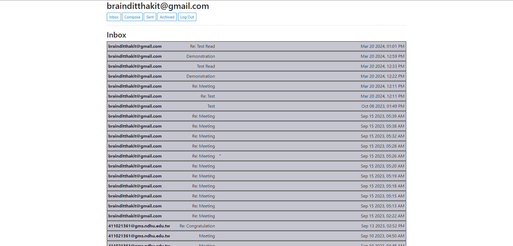
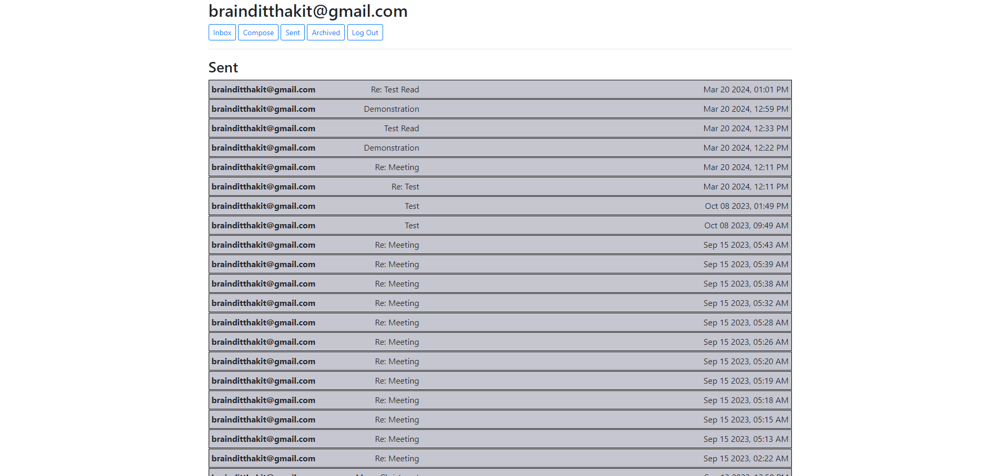
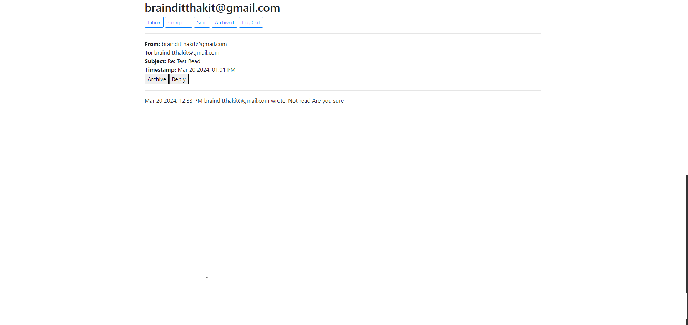
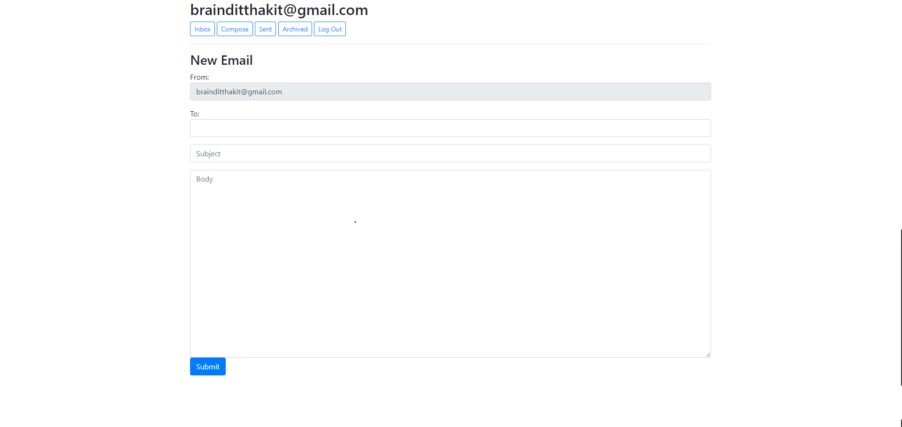
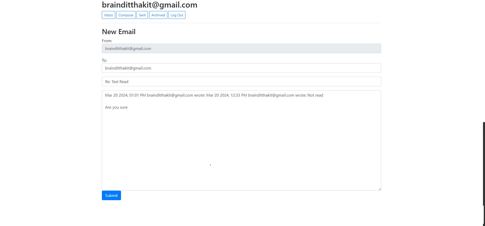
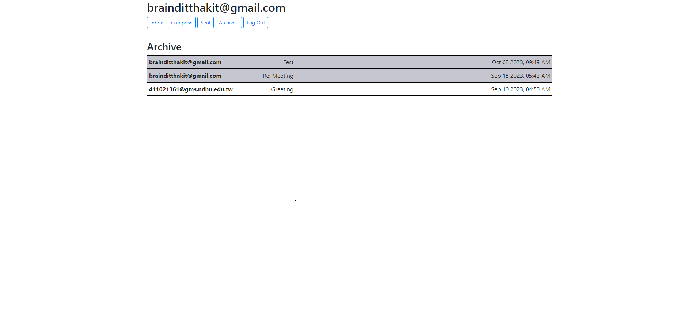

# Project 3 - Mail

&nbsp;&nbsp;&nbsp;&nbsp;This is my fourth project in my CS50’s Web Programming with Python and JavaScript course that I taken. In this project, I have to design a  a front-end for an email client that makes API calls to send and receive emails.

## Specification

* Send Mail
    * When a user submits the email composition form, add JavaScript code to actually send the email.
    * Once the email has been sent, load the user’s sent mailbox.

* Mailbox
    * When a mailbox is visited, the application will first query the API for the latest emails in that mailbox.
    * When a mailbox is visited, the name of the mailbox will appear at the top of the page
    * Each email will then be rendered in its own box (e.g. as a 
 with a border) that displays who the email is from, what the subject line is, and the timestamp of the email.
    * If the email is unread, it will appear with a white background. If the email has been read, it will appear with a gray background.

* View Email
    * When a user clicks on an email, the user will be taken to a view where they see the content of that email.
    * The application show the email’s sender, recipients, subject, timestamp, and body

* Archive and Unarchive
    * Allow users to archive and unarchive emails that they have received.
    * When viewing an Inbox email, the user will be presented with a button that lets them archive the email. When viewing an Archive email, the user will be presented with a button that lets them unarchive the email.
    * Once an email has been archived or unarchived, load the user’s inbox.

* Reply
    * Allow users to reply to an email.
    * When viewing an email, the user should be presented with a “Reply” button that lets them reply to the email.
    * When the user clicks the “Reply” button, they should be taken to the email composition form.

## Pages

### Home Page

### Sent Mail Page

### Display Message in Email Page

### Compose Page

### Reply Page

### Archive Page

## Video Explaination

Video : https://www.youtube.com/watch?v=XvyArKlHbks